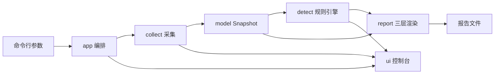

# Desktop-Diag 架构说明

## 目标和边界

Desktop-Diag 是 Windows 控制台诊断程序。生产运行链只采集系统信息、执行固定的网络可达性探测、计算诊断规则并写入报告和标准输出。它不修改系统配置，不启动外部进程，不驻留。

## 数据流

## 包职责

| 包 | 责任 | 主要边界 |
| --- | --- | --- |
| `cmd/desktop-diag` | 进程入口 | 解析参数后调用 `internal/app` |
| `internal/app` | 流程编排 | 串联采集、判定、渲染、落盘和退出码 |
| `internal/cli` | CLI 契约 | `-o`、`-v`、`-version`、`-h/--help` |
| `internal/collect` | 系统采集 | 主机、网卡、健康度和网络探测调度 |
| `internal/probe` | 网络探测 | ICMP、DNS、TCP 和结果分类 |
| `internal/model` | 数据模型 | Snapshot、证据、失败状态和结论类型；保持纯逻辑 |
| `internal/detect` | 规则引擎 | 读取 Snapshot，输出稳定排序的告警；保持纯逻辑 |
| `internal/report` | 报告 | 三层文本渲染、UTF-8 BOM/CRLF、降级目录和防覆盖写入 |
| `internal/ui` | 控制台 | 进度、详细模式、颜色降级和代码页恢复 |
| `internal/winapi` | Win32 封装 | Windows API、只读注册表和控制台 API |
| `internal/version` | 构建元数据 | 版本、提交号和构建时间的 `-ldflags` 注入 |
| `scripts` | 开发自动化 | 构建、测试、发布和质量门禁，不属于生产运行链 |

## 采集与证据

采集器将结果写入 `model.Snapshot`。每项结果保留成功、部分采集、失败、跳过和取消等状态；缺少证据时，规则引擎不能把未执行当作失败。网络探测使用固定参数：ICMP 四个数据包、单包超时 1 秒；TCP 连接超时 3 秒；DNS 查询超时 3 秒。

ICMP 网关结果保留接口索引和名称用于报告归属。Windows `IcmpSendEcho` 的实际出接口由系统路由表决定，程序不会把它解释成完成了接口绑定。DNS 和 TCP 探测是全局证据，报告会保留这一范围。

## 规则和报告

`internal/detect` 的规则读取模型数据，不发起系统调用或网络请求。规则输出告警等级、类别、标题、详情、证据和建议方向，并按固定顺序渲染。

`internal/report` 将结果组织为三层：告警汇总、结构化检测详情、原始数据附录。报告写入使用排他创建，撞名时追加序号；候选目录不可写时按降级链继续尝试，并在报告中说明实际位置和原因。

## 合规边界

生产源码的写操作只服务于报告目录、报告文件和失败清理。网络操作只执行固定的 ICMP、DNS 和 TCP 连通性探测，不上传报告、终端标识或业务数据。生产代码不调用 PowerShell、WMI、COM、脚本引擎或外部命令。

阶段四的 ICMP 调查发现，Low Mandatory Level 工作区会影响进程完整性级别和 ICMP 调用。该环境限制不等于普通用户必须提权；产品继续执行其余采集并记录拒绝原因。

## 构建和验证

`scripts/build.ps1`、`scripts/test.ps1`、`scripts/release.ps1` 固定 Go 1.26.0 的子进程工具链。`scripts/quality-gate.ps1` 统一执行格式、vet、全量测试、覆盖率、Windows amd64/arm64 交叉编译和生产源码红线扫描。GitHub Actions 在 `windows-latest` 上重复这套门禁并归档验证产物。

交叉编译只证明目标架构可构建，不能替代目标设备真机验收。当前未覆盖环境见 [阶段四收口](phase4/README.md)。
